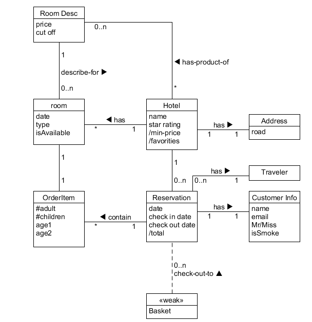
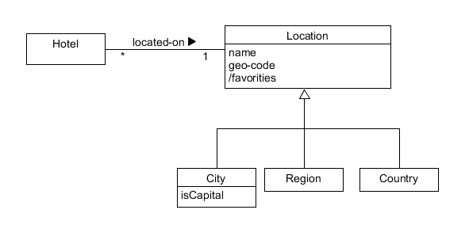

# Week9 领域建模 - 对象状态

1. 使用类图，分别对 Asg_RH 文档中 Make Reservation 用例以及 Payment 用例开展领域建模。然后，根据上述模型，给出建议的数据表以及主要字段，特别是主键和外键

- 数据建模
	Hotel(ID/KEY, name, address, location)  
	Room(ID/KEY, type, date, availability)  
	Customer(ID/KEY, name, email)  
	ReservationItem(ID/KEY, type, checkInDate, checkOutDate, numberOfNights/Adults/Children)  
	ReservationBasket(ID/KEY, CustomerID/KEY)  
	Payment(ID/KEY, date, time)  
	PaymentItem(ID/KEY, price, information)  
	CreditCard(ID/KEY, type, number, securityCode, expiryDate, CustomerID/key)

2. 使用 UML State Model，对每个订单对象生命周期建模

